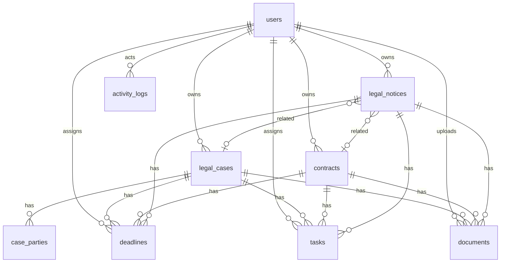
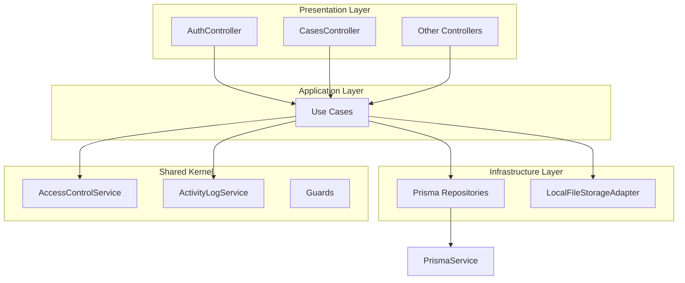

# Legal Management Module — FINAL Implementation Blueprint

**Status**: **FROZEN** — single source of truth. Do not redesign during implementation.
**Assignment**: [AI Coding Interview Assignment.pdf](c:\Users\saeed\OneDrive\Documents\node code\legal-management-module\AI Coding Interview Assignment.pdf)
**Timebox**: 1–2 days | **Style**: Lightweight DDD + Hexagonal | **No overengineering**

> **Implementation rule**: Follow this blueprint exactly. Do not add patterns, abstractions, modules, or layers while coding.

---

## Frozen Architecture — Final Refinements

These five decisions are locked. No exceptions during implementation.

### 1. Repository Strategy

- **Concrete Prisma repositories only** — e.g. `PrismaCaseRepository`, `PrismaDeadlineRepository`
- **No repository interfaces** for any entity
- Use cases inject concrete `@Injectable()` repository classes directly
- **PrismaService** may be injected directly in use cases only for multi-aggregate transactions (notice + deadline, bulk offboarding) — documented pragmatic exceptions
- **One Port only**: `FileStoragePort` — because filesystem is the external system that may change

### 2. File Storage

- Local `./uploads/` folder (gitignored)
- Document metadata in PostgreSQL `documents` table
- `FileStoragePort` (interface) + `LocalFileStorageAdapter` (implementation)
- **No** S3, MinIO, cloud storage, presigned URLs, or storage abstraction beyond this single port

### 3. Activity Log

- Single **`ActivityLogService`** in `src/shared/activity-log/`, exported globally via NestJS DI
- Use cases **call `activityLogService.log(...)`** — they do not implement logging logic themselves
- No interceptors, no Prisma middleware, no domain events for audit
- Transaction variant: `activityLogService.logWithinTransaction(tx, ...)` for atomic notice+deadline creates
- Every write operation must produce one ActivityLog row before the use case returns

### 4. Dashboard

- **Not a domain entity** — no Dashboard table, model, or repository
- `GetDashboardSummaryUseCase` runs live Prisma `count()` queries over existing tables
- **No** cache, materialized views, background jobs, or precomputed aggregates

### 5. Domain Layer (Minimal)

Each module's `domain/` folder contains **only**:

- Entity types (plain TypeScript types/interfaces — not ORM models)
- Enums
- Value objects **only if truly needed** (none required for MVP)
- Pure business rule functions (e.g. date validation helpers) when they don't belong in a use case

**Do NOT add** to domain layer: Domain Events, Factories, Specifications, Policies, complex Domain Services, aggregate base classes, or rich entity behavior.

Business orchestration lives in **application/use cases**. IO lives in **infrastructure**.

---

## Stack (Fixed)

| Use | Technology |
|-----|------------|
| Framework | NestJS 10+ |
| Database | PostgreSQL 16 |
| ORM | Prisma |
| Auth | JWT (Passport) + bcrypt |
| Validation | class-validator + class-transformer |
| API docs | @nestjs/swagger |
| Logging | nestjs-pino (Pino) |
| Container | Docker Compose |
| Tests | Jest (unit + e2e) |

**Explicitly excluded**: CQRS, Event Sourcing, Domain Events, Event Bus, Saga, Kafka, RabbitMQ, Redis, Elasticsearch, Refresh Tokens, OAuth, S3, MinIO, microservices, WebSockets, notifications, email, background jobs, any external integrations.

---

## Project Structure (Complete)

```
legal-management-module/
├── docker-compose.yml          # Postgres + app services
├── Dockerfile                  # Multi-stage NestJS build
├── .env.example                # Documented env vars
├── .gitignore                  # includes uploads/, .env, node_modules
├── package.json
├── tsconfig.json
├── nest-cli.json
├── README.md
├── AI_USAGE.md
│
├── prisma/
│   ├── schema.prisma           # Single schema — all tables
│   ├── migrations/             # Prisma migration history
│   └── seed.ts                 # Realistic demo data
│
├── uploads/                    # Local file storage (gitignored)
│
├── test/
│   ├── jest-e2e.json
│   ├── helpers/                # Test DB setup, auth helper (getToken)
│   ├── unit/                   # Use case unit tests
│   └── e2e/                    # API integration tests
│
└── src/
    ├── main.ts                 # Bootstrap: Pino, Swagger, ValidationPipe, global prefix
    ├── app.module.ts           # Root module — imports all feature modules
    │
    ├── config/
    │   ├── config.module.ts
    │   ├── env.validation.ts   # Joi/Zod schema for env vars
    │   └── constants.ts        # APP_TIMEZONE, JWT expiry, upload limits
    │
    ├── prisma/
    │   ├── prisma.module.ts    # Global PrismaModule
    │   └── prisma.service.ts   # Extends PrismaClient, connects on init
    │
    ├── shared/                 # Shared kernel (cross-cutting, no business aggregates)
    │   ├── access-control/
    │   │   ├── access-control.module.ts
    │   │   └── access-control.service.ts    # canView, canEdit, buildScopeFilter
    │   ├── activity-log/
    │   │   ├── activity-log.module.ts
    │   │   ├── activity-log.service.ts      # log() + list()
    │   │   └── domain/
    │   │       └── audit-action.enum.ts     # Shared enum used by all modules
    │   ├── decorators/
    │   │   ├── current-user.decorator.ts
    │   │   └── roles.decorator.ts
    │   ├── guards/
    │   │   ├── jwt-auth.guard.ts
    │   │   └── roles.guard.ts
    │   ├── filters/
    │   │   └── http-exception.filter.ts     # Consistent error JSON + Prisma error mapping
    │   ├── interceptors/
    │   │   └── logging.interceptor.ts       # Optional request timing (Pino handles most)
    │   ├── dto/
    │   │   ├── pagination-query.dto.ts
    │   │   └── paginated-response.dto.ts
    │   ├── types/
    │   │   ├── authenticated-user.type.ts
    │   │   └── entity-type.enum.ts
    │   └── utils/
    │       ├── reference-code.util.ts       # CASE-2026-00001 generator
    │       ├── persian-date.util.ts         # Gregorian → Jalali string for responses
    │       └── date-boundary.util.ts        # startOfDay in APP_TIMEZONE
    │
    └── modules/
        ├── auth/
        │   ├── auth.module.ts
        │   ├── domain/                        # Auth-specific types only
        │   ├── application/
        │   │   ├── login.use-case.ts
        │   │   └── get-me.use-case.ts
        │   ├── infrastructure/
        │   │   └── prisma-user.repository.ts  # findByEmail — concrete, no interface
        │   └── presentation/
        │       ├── auth.controller.ts
        │       └── dto/
        │
        ├── cases/
        │   ├── cases.module.ts
        │   ├── domain/
        │   │   ├── case-status.enum.ts
        │   │   ├── case-type.enum.ts
        │   │   └── party-type.enum.ts
        │   ├── application/
        │   │   ├── create-case.use-case.ts
        │   │   ├── list-cases.use-case.ts
        │   │   ├── get-case.use-case.ts
        │   │   ├── update-case.use-case.ts
        │   │   ├── delete-case.use-case.ts
        │   │   ├── reassign-case.use-case.ts
        │   │   ├── list-parties.use-case.ts
        │   │   └── add-party.use-case.ts
        │   ├── infrastructure/
        │   │   └── prisma-case.repository.ts
        │   └── presentation/
        │       ├── cases.controller.ts
        │       └── dto/
        │
        ├── contracts/          # Same 4-layer layout as cases
        ├── notices/              # Same layout + CreateNotice creates deadline in transaction
        ├── deadlines/            # Same layout + view filter logic
        ├── tasks/
        ├── documents/
        │   ├── domain/
        │   │   └── file-storage.port.ts       # ONLY port in the entire project
        │   ├── infrastructure/
        │   │   ├── prisma-document.repository.ts   # concrete, no interface
        │   │   └── local-file-storage.adapter.ts   # implements FileStoragePort
        │   └── application/
        │       ├── upload-document.use-case.ts
        │       └── download-document.use-case.ts
        │
        ├── activity-log/         # Read-only API module (writes via shared service)
        │   └── presentation/
        │       └── activity-log.controller.ts
        │
        ├── dashboard/
        │   └── application/
        │       └── get-dashboard-summary.use-case.ts
        │
        └── offboarding/
            └── application/
                └── bulk-transfer-ownership.use-case.ts
```

### Why each top-level area exists

| Path | Purpose |
|------|---------|
| `docker-compose.yml` | One-command Postgres + app for reviewers |
| `prisma/` | Schema, migrations, seed — data layer source of truth |
| `uploads/` | Local binary storage; metadata lives in Postgres |
| `test/` | Separated unit (fast, mocked) vs e2e (real DB) |
| `src/config/` | Validated environment; no magic strings in use cases |
| `src/prisma/` | Single PrismaService wired globally |
| `src/shared/` | Cross-cutting services reused by all modules — not a "god module" |
| `src/modules/*/` | One bounded context per legal subdomain |
| `domain/` per module | Pure enums/types/rules — zero NestJS/Prisma imports |
| `application/` | Use cases — orchestration, authorization checks, calls repos + ActivityLog |
| `infrastructure/` | Prisma repositories + file adapter — only layer that touches IO |
| `presentation/` | HTTP surface — controllers, DTOs, Swagger decorators |

---

## Domain Model

### 1. User

| | |
|-|-|
| **Purpose** | Authenticated actor; owner and assignee references |
| **Fields** | `id` (UUID), `email`, `passwordHash`, `fullName`, `role`, `isActive`, `createdAt`, `updatedAt` |
| **Enums** | `UserRole`: `LEGAL_ADMIN`, `LEGAL_MANAGER`, `LEGAL_COUNSEL`, `VIEWER` |
| **Relationships** | Owns Cases/Contracts/Notices; assigned Tasks/Deadlines; uploads Documents; acts in ActivityLogs |
| **Ownership** | Standalone entity — not owned by another aggregate |
| **Rules** | Email unique; inactive cannot login; role set at seed (no user CRUD API) |

### 2. LegalCase (Aggregate Root)

| | |
|-|-|
| **Purpose** | System of record for a legal matter/dispute |
| **Fields** | `id`, `referenceCode`, `title`, `type`, `status`, `priority`, `ownerId`, `description`, `openedDate`, `closedDate`, `deletedAt`, timestamps |
| **Enums** | `CaseType`: LITIGATION, ARBITRATION, REGULATORY, INTERNAL, OTHER — `CaseStatus`: OPEN, IN_PROGRESS, ON_HOLD, CLOSED — `Priority`: LOW, MEDIUM, HIGH, CRITICAL |
| **Relationships** | 1:N CaseParty, Task, Document, Deadline; referenced optionally by Notice |
| **Ownership** | Owned by User (`ownerId`); owns CaseParties |
| **Rules** | Unique referenceCode; soft-deleted excluded from lists; status changes audited; case "timeline" = ActivityLogs where entityType=CASE |

### 3. CaseParty

| | |
|-|-|
| **Purpose** | Involved parties on a case (assignment requirement) |
| **Fields** | `id`, `caseId`, `name`, `partyType`, `contactInfo`, `notes` |
| **Enums** | `PartyType`: PLAINTIFF, DEFENDANT, THIRD_PARTY, INTERNAL |
| **Relationships** | N:1 LegalCase |
| **Ownership** | Owned by LegalCase |
| **Rules** | Name required; deleted when case hard-deleted (or cascade soft via case) |

### 4. Contract (Aggregate Root)

| | |
|-|-|
| **Purpose** | Commercial/legal agreement tracking |
| **Fields** | `id`, `referenceCode`, `title`, `type`, `status`, `ownerId`, `counterpartyName`, `effectiveDate`, `expirationDate`, `renewalDate`, `keyTerms`, `deletedAt`, timestamps |
| **Enums** | `ContractType`: NDA, MSA, EMPLOYMENT, VENDOR, LEASE, OTHER — `ContractStatus`: DRAFT, ACTIVE, EXPIRED, TERMINATED, UNDER_REVIEW |
| **Relationships** | 1:N Task, Document, Deadline; referenced optionally by Notice |
| **Ownership** | Owned by User |
| **Rules** | expirationDate >= effectiveDate; unique referenceCode |

### 5. LegalNotice (Aggregate Root)

| | |
|-|-|
| **Purpose** | Official notice intake with response obligation |
| **Fields** | `id`, `referenceCode`, `title`, `sender`, `receivedDate`, `responseDeadline`, `status`, `ownerId`, `description`, `relatedCaseId`, `relatedContractId`, `deletedAt`, timestamps |
| **Enums** | `NoticeStatus`: RECEIVED, UNDER_REVIEW, RESPONDED, CLOSED, OVERDUE |
| **Relationships** | 1:N Task, Document, Deadline; optional N:1 Case, Contract |
| **Ownership** | Owned by User |
| **Rules** | responseDeadline required on create; create must also insert linked Deadline in same transaction |

### 6. Deadline

| | |
|-|-|
| **Purpose** | **Critical** — unified obligation calendar |
| **Fields** | `id`, `title`, `dueDate`, `status`, `assigneeId`, `caseId`, `contractId`, `noticeId`, `completedAt`, `createdById`, timestamps |
| **Enums** | `DeadlineStatus`: PENDING, COMPLETED, CANCELLED — (OVERDUE is computed at query time, not stored) |
| **Relationships** | N:1 exactly one of Case/Contract/Notice; N:1 assignee User; N:1 creator User |
| **Ownership** | Owned by parent matter aggregate |
| **Rules** | Exactly one parent FK non-null; overdue = PENDING + dueDate < today (APP_TIMEZONE); completing sets completedAt |

### 7. Task

| | |
|-|-|
| **Purpose** | Collaboration work item on a matter |
| **Fields** | `id`, `title`, `description`, `status`, `assigneeId`, `dueDate`, `caseId`, `contractId`, `noticeId`, `createdById`, `completedAt`, timestamps |
| **Enums** | `TaskStatus`: TODO, IN_PROGRESS, DONE, CANCELLED |
| **Relationships** | N:1 one parent; N:1 assignee, creator |
| **Ownership** | Owned by parent matter |
| **Rules** | Exactly one parent FK; assignee must be active user |

### 8. Document

| | |
|-|-|
| **Purpose** | File metadata; binary on local disk |
| **Fields** | `id`, `fileName`, `mimeType`, `fileSize`, `storageKey`, `documentType`, `description`, `uploadedById`, `caseId`, `contractId`, `noticeId`, `deletedAt`, `uploadedAt` |
| **Enums** | `DocumentType`: CONTRACT, EVIDENCE, CORRESPONDENCE, FILING, OTHER |
| **Relationships** | N:1 one parent; N:1 uploader |
| **Ownership** | Owned by parent matter |
| **Rules** | Access = parent access; storageKey is UUID filename; soft delete metadata only (file may remain on disk for MVP simplicity) |

### 9. ActivityLog

| | |
|-|-|
| **Purpose** | Append-only audit trail |
| **Fields** | `id`, `actorId`, `action`, `entityType`, `entityId`, `metadata` (JSON), `createdAt` |
| **Enums** | `AuditAction`: CREATED, UPDATED, DELETED, STATUS_CHANGED, REASSIGNED, DOCUMENT_UPLOADED, DEADLINE_COMPLETED, OWNERSHIP_TRANSFERRED — `EntityType`: USER, CASE, CONTRACT, NOTICE, DEADLINE, TASK, DOCUMENT |
| **Relationships** | N:1 actor User |
| **Ownership** | System-owned; never nested under aggregates |
| **Rules** | Insert-only; written synchronously after every mutation |

### Removed from MVP (do not implement)

TimelineEntry, OwnershipTransfer table, Discussion, FinancialRecord, Notification, RefreshToken, any queue/event tables.

---

## Final Database Design

### ER Diagram



### Table Definitions

#### users
| Column | Type | Constraints |
|--------|------|-------------|
| id | UUID | PK, default gen_random_uuid() |
| email | VARCHAR(255) | UNIQUE, NOT NULL |
| password_hash | VARCHAR(255) | NOT NULL |
| full_name | VARCHAR(255) | NOT NULL |
| role | user_role enum | NOT NULL |
| is_active | BOOLEAN | DEFAULT true |
| created_at | TIMESTAMPTZ | DEFAULT now() |
| updated_at | TIMESTAMPTZ | updated by Prisma |

#### legal_cases
| Column | Type | Constraints |
|--------|------|-------------|
| id | UUID | PK |
| reference_code | VARCHAR(50) | UNIQUE, NOT NULL |
| title | VARCHAR(500) | NOT NULL |
| type | case_type enum | NOT NULL |
| status | case_status enum | NOT NULL |
| priority | priority enum | NOT NULL |
| owner_id | UUID | FK → users.id, NOT NULL |
| description | TEXT | nullable |
| opened_date | DATE | nullable |
| closed_date | DATE | nullable |
| deleted_at | TIMESTAMPTZ | nullable (soft delete) |
| created_at, updated_at | TIMESTAMPTZ | |

**Indexes**: `owner_id`, `status`, `deleted_at`, UNIQUE `reference_code`

#### case_parties
| Column | Type | Constraints |
|--------|------|-------------|
| id | UUID | PK |
| case_id | UUID | FK → legal_cases.id ON DELETE CASCADE |
| name | VARCHAR(255) | NOT NULL |
| party_type | party_type enum | NOT NULL |
| contact_info | VARCHAR(500) | nullable |
| notes | TEXT | nullable |

**Indexes**: `case_id`

#### contracts
| Column | Type | Constraints |
|--------|------|-------------|
| id | UUID | PK |
| reference_code | VARCHAR(50) | UNIQUE, NOT NULL |
| title, type, status, owner_id | | same pattern as cases |
| counterparty_name | VARCHAR(255) | NOT NULL |
| effective_date, expiration_date, renewal_date | DATE | nullable |
| key_terms | TEXT | nullable |
| deleted_at | TIMESTAMPTZ | nullable |

**Indexes**: `owner_id`, `status`, `expiration_date`, UNIQUE `reference_code`

#### legal_notices
| Column | Type | Constraints |
|--------|------|-------------|
| id | UUID | PK |
| reference_code | VARCHAR(50) | UNIQUE, NOT NULL |
| title | VARCHAR(500) | NOT NULL |
| sender | VARCHAR(255) | NOT NULL |
| received_date | DATE | NOT NULL |
| response_deadline | DATE | NOT NULL |
| status | notice_status enum | NOT NULL |
| owner_id | UUID | FK → users |
| description | TEXT | nullable |
| related_case_id | UUID | FK → legal_cases, nullable |
| related_contract_id | UUID | FK → contracts, nullable |
| deleted_at | TIMESTAMPTZ | nullable |

**Indexes**: `owner_id`, `response_deadline`, `status`, UNIQUE `reference_code`

#### deadlines
| Column | Type | Constraints |
|--------|------|-------------|
| id | UUID | PK |
| title | VARCHAR(500) | NOT NULL |
| due_date | DATE | NOT NULL |
| status | deadline_status enum | NOT NULL |
| assignee_id | UUID | FK → users, nullable |
| case_id | UUID | FK → legal_cases, nullable |
| contract_id | UUID | FK → contracts, nullable |
| notice_id | UUID | FK → legal_notices, nullable |
| completed_at | TIMESTAMPTZ | nullable |
| created_by_id | UUID | FK → users, NOT NULL |

**CHECK constraint**: `(case_id IS NOT NULL)::int + (contract_id IS NOT NULL)::int + (notice_id IS NOT NULL)::int = 1`

**Indexes**: `(due_date, status)`, `(assignee_id, due_date, status)`, each FK column

#### tasks
Same parent FK pattern as deadlines + CHECK constraint.

**Indexes**: `(assignee_id, status)`, parent FK columns

#### documents
Same parent FK pattern + CHECK constraint.

**Indexes**: `(case_id)`, `(contract_id)`, `(notice_id)`, UNIQUE `(storage_key)`

#### activity_logs
| Column | Type | Constraints |
|--------|------|-------------|
| id | UUID | PK |
| actor_id | UUID | FK → users, NOT NULL |
| action | audit_action enum | NOT NULL |
| entity_type | entity_type enum | NOT NULL |
| entity_id | UUID | NOT NULL |
| metadata | JSONB | DEFAULT '{}' |
| created_at | TIMESTAMPTZ | DEFAULT now() |

**Indexes**: `(entity_type, entity_id, created_at DESC)`, `(actor_id, created_at DESC)`

### Relationship Summary

| From | To | FK location | Cardinality | Why |
|------|-----|-------------|-------------|-----|
| legal_cases | users | owner_id | N:1 | Matter ownership / offboarding |
| case_parties | legal_cases | case_id | N:1 | Parties belong to one case |
| contracts | users | owner_id | N:1 | Contract ownership |
| legal_notices | users | owner_id | N:1 | Notice ownership |
| legal_notices | legal_cases | related_case_id | N:1 optional | Cross-reference |
| legal_notices | contracts | related_contract_id | N:1 optional | Cross-reference |
| deadlines/tasks/documents | cases/contracts/notices | case_id / contract_id / notice_id | N:1 | Child of exactly one matter |
| activity_logs | users | actor_id | N:1 | Who performed the action |

---

## Module Boundaries



### Module Registry

| Module | Responsibility | Imports | Exports |
|--------|---------------|---------|---------|
| **ConfigModule** | Env validation | — | ConfigService |
| **PrismaModule** | DB connection | — | PrismaService (global) |
| **SharedAccessControlModule** | Permission helpers | PrismaModule | AccessControlService |
| **SharedActivityLogModule** | Audit write/read | PrismaModule | ActivityLogService |
| **AuthModule** | Login, JWT, /me | Prisma, Passport | JwtModule (global) |
| **CasesModule** | Case + party CRUD, reassign | Shared modules | — |
| **ContractsModule** | Contract CRUD, reassign | Shared modules | — |
| **NoticesModule** | Notice CRUD + auto-deadline | Shared, Deadlines infra helper | — |
| **DeadlinesModule** | Deadline CRUD + 4 views | Shared modules | — |
| **TasksModule** | Task CRUD | Shared modules | — |
| **DocumentsModule** | Upload/download/list | Shared, FileStoragePort | — |
| **ActivityLogModule** | GET audit trail only | SharedActivityLogModule | — |
| **DashboardModule** | Aggregated counts | Prisma, AccessControl | — |
| **OffboardingModule** | Bulk ownership transfer | Prisma, SharedActivityLog, AccessControl | — |

**Dependency rules**:
- Feature modules never import each other's use cases
- All mutations go through own module's use cases
- `ActivityLogService` is the only shared write path for audit
- `NoticesModule` may inject `PrismaService` directly for cross-aggregate transaction (notice + deadline) — acceptable pragmatic exception documented in interview

---

## REST API Design (Final)

**Base URL**: `/api/v1`
**Auth header**: `Authorization: Bearer <token>` (except login, health)
**List response shape**: `{ data: T[], meta: { page, limit, total } }`
**Single response shape**: `{ data: T }`
**Error shape**: `{ statusCode, message, errors? }`

### Auth Module — `/auth`

| Method | Route | Authorization | Purpose | Response |
|--------|-------|---------------|---------|----------|
| POST | `/auth/login` | Public | Email/password login | `{ data: { accessToken, user: { id, email, fullName, role } } }` |
| GET | `/auth/me` | JWT | Current user | `{ data: { id, email, fullName, role } }` |

### Health — `/health`

| Method | Route | Authorization | Purpose | Response |
|--------|-------|---------------|---------|----------|
| GET | `/health` | Public | Docker readiness | `{ data: { status: "ok" } }` |

### Dashboard — `/dashboard`

| Method | Route | Authorization | Purpose | Response |
|--------|-------|---------------|---------|----------|
| GET | `/dashboard/summary` | JWT (scoped) | Counts for home view | `{ data: { openCases, activeContracts, pendingNotices, overdueDeadlines, todayDeadlines, myOpenTasks } }` |

### Cases — `/cases`

| Method | Route | Authorization | Purpose | Response |
|--------|-------|---------------|---------|----------|
| GET | `/cases` | JWT scoped | List cases (paginated, filter by status/type/ownerId) | `{ data: Case[], meta }` |
| POST | `/cases` | Admin, Manager, Counsel | Create case + optional parties | `{ data: Case }` |
| GET | `/cases/:id` | JWT scoped | Case detail with parties | `{ data: Case }` |
| PATCH | `/cases/:id` | Admin, Manager, Owner | Update fields / status | `{ data: Case }` |
| DELETE | `/cases/:id` | Admin, Manager | Soft delete | `{ data: { success: true } }` |
| POST | `/cases/:id/reassign` | Admin, Manager | Change ownerId | `{ data: Case }` |
| GET | `/cases/:id/parties` | JWT scoped | List parties | `{ data: CaseParty[] }` |
| POST | `/cases/:id/parties` | Admin, Manager, Owner | Add party | `{ data: CaseParty }` |

### Contracts — `/contracts`

| Method | Route | Authorization | Purpose | Response |
|--------|-------|---------------|---------|----------|
| GET | `/contracts` | JWT scoped | List contracts | `{ data: Contract[], meta }` |
| POST | `/contracts` | Admin, Manager, Counsel | Create contract | `{ data: Contract }` |
| GET | `/contracts/:id` | JWT scoped | Contract detail | `{ data: Contract }` |
| PATCH | `/contracts/:id` | Admin, Manager, Owner | Update | `{ data: Contract }` |
| DELETE | `/contracts/:id` | Admin, Manager | Soft delete | `{ data: { success: true } }` |
| POST | `/contracts/:id/reassign` | Admin, Manager | Reassign owner | `{ data: Contract }` |

### Notices — `/notices`

| Method | Route | Authorization | Purpose | Response |
|--------|-------|---------------|---------|----------|
| GET | `/notices` | JWT scoped | List notices | `{ data: Notice[], meta }` |
| POST | `/notices` | Admin, Manager, Counsel | Register notice + auto deadline | `{ data: Notice }` |
| GET | `/notices/:id` | JWT scoped | Notice detail | `{ data: Notice }` |
| PATCH | `/notices/:id` | Admin, Manager, Owner | Update/status | `{ data: Notice }` |
| DELETE | `/notices/:id` | Admin, Manager | Soft delete | `{ data: { success: true } }` |
| POST | `/notices/:id/reassign` | Admin, Manager | Reassign owner | `{ data: Notice }` |

### Deadlines — `/deadlines`

| Method | Route | Authorization | Purpose | Response |
|--------|-------|---------------|---------|----------|
| GET | `/deadlines` | JWT scoped | List with `view` filter | `{ data: Deadline[], meta }` |
| POST | `/deadlines` | Admin, Manager, parent owner | Create deadline | `{ data: Deadline }` |
| GET | `/deadlines/:id` | JWT scoped | Deadline detail | `{ data: Deadline }` |
| PATCH | `/deadlines/:id` | Admin, Manager, assignee, parent owner | Update/complete | `{ data: Deadline }` |
| DELETE | `/deadlines/:id` | Admin, Manager, parent owner | Cancel (status=CANCELLED) | `{ data: { success: true } }` |

**Query param `view`**:
- `upcoming` — PENDING, dueDate > today, order by dueDate ASC
- `overdue` — PENDING, dueDate < today
- `today` — PENDING, dueDate = today
- `assigned-to-me` — assigneeId = currentUser.id, PENDING

Deadline responses include computed `dueDatePersian` (not stored).

### Tasks — `/tasks`

| Method | Route | Authorization | Purpose | Response |
|--------|-------|---------------|---------|----------|
| GET | `/tasks` | JWT scoped | List (filter assigneeId, status, parent) | `{ data: Task[], meta }` |
| POST | `/tasks` | Admin, Manager, parent editor | Create task | `{ data: Task }` |
| GET | `/tasks/:id` | JWT scoped | Task detail | `{ data: Task }` |
| PATCH | `/tasks/:id` | Admin, Manager, assignee, creator | Update status/fields | `{ data: Task }` |
| DELETE | `/tasks/:id` | Admin, Manager, creator | Cancel task | `{ data: { success: true } }` |

### Documents — `/documents`

| Method | Route | Authorization | Purpose | Response |
|--------|-------|---------------|---------|----------|
| GET | `/documents` | JWT scoped | List by `caseId` / `contractId` / `noticeId` | `{ data: Document[] }` |
| POST | `/documents` | Admin, Manager, parent editor | Multipart upload | `{ data: Document }` |
| GET | `/documents/:id` | JWT scoped | Metadata | `{ data: Document }` |
| GET | `/documents/:id/download` | JWT scoped | Stream file | Binary stream |
| DELETE | `/documents/:id` | Admin, Manager, uploader | Soft delete metadata | `{ data: { success: true } }` |

### Activity Logs — `/activity-logs`

| Method | Route | Authorization | Purpose | Response |
|--------|-------|---------------|---------|----------|
| GET | `/activity-logs` | JWT scoped | Audit trail (filter entityType, entityId, actorId) | `{ data: ActivityLog[], meta }` |

Case timeline: `GET /activity-logs?entityType=CASE&entityId=<uuid>`

### Offboarding — `/offboarding`

| Method | Route | Authorization | Purpose | Response |
|--------|-------|---------------|---------|----------|
| POST | `/offboarding/transfer` | Admin, Manager | Bulk reassign ownership | `{ data: { cases, contracts, notices, tasks, deadlines } }` counts |

---

## Security

### Authentication

- Email + password against `users` table
- bcrypt compare (cost factor 10)
- JWT payload: `{ sub: userId, email, role }` — no sensitive data
- Token expiry: 8 hours (configurable via `JWT_EXPIRES_IN`) — no refresh tokens
- `@UseGuards(JwtAuthGuard)` on all routes except `/auth/login`, `/health`
- Inactive users → 401 on login

### Authorization

Two layers applied in every use case:

1. **Role guard** (`@Roles(...)`) on controller — coarse gate
2. **AccessControlService** in use case — fine-grained:
   - `LEGAL_ADMIN`, `LEGAL_MANAGER` → full access
   - `LEGAL_COUNSEL` → view/edit if `ownerId === user.id` OR assigned on task/deadline
   - `VIEWER` → read-only; reject all mutations

List queries inject scope via `buildListScope(user)` → Prisma `where` clause.

### Validation

- Global `ValidationPipe`: `whitelist: true`, `forbidNonWhitelisted: true`, `transform: true`
- DTOs in presentation layer only
- Business rules in use cases (date ordering, parent FK exclusivity)
- File upload: max 20MB; allowed mime types: `application/pdf`, `application/msword`, `application/vnd.openxmlformats-officedocument.wordprocessingml.document`, `image/png`, `image/jpeg`

### Audit Logging

See dedicated section below.

### Soft Delete

- Applied to: `legal_cases`, `contracts`, `legal_notices`, `documents`
- Set `deleted_at = now()` — never hard delete in MVP
- All list/detail queries filter `deleted_at IS NULL`
- DELETE endpoints are idempotent on already-deleted records → 404

### Error Handling

- `HttpExceptionFilter` catches all exceptions
- Map Prisma errors: `P2002` → 409 Conflict, `P2025` → 404 Not Found
- Validation errors → 400 with field array
- 403 Forbidden when AccessControlService denies
- 401 Unauthorized for bad/missing JWT
- Pino logs 5xx with stack; client never sees stack traces

---

## Activity Log (Centralized via DI)

### Pattern: Use cases delegate to one shared service — no logging logic in use cases themselves

```
UseCase.execute()
  → validate auth (AccessControlService)
  → Prisma write via concrete repository (optionally $transaction)
  → activityLogService.log({ actorId, action, entityType, entityId, metadata })
  → return response
```

Use cases **inject** `ActivityLogService` via constructor DI. They pass action + entity + optional metadata. All insert logic, enum mapping, and JSON serialization live inside `ActivityLogService` only.

### ActivityLogService (shared/activity-log/)

- Registered in `ActivityLogModule`, exported globally
- `log(input)` — insert into `activity_logs`
- `logWithinTransaction(tx, input)` — insert using transaction client (notice + deadline create)
- `list(filters, scope, pagination)` — read path for `ActivityLogController`
- **No** separate audit helper classes, mixins, or base use case classes

### Metadata conventions (JSON)

| Action | metadata example |
|--------|------------------|
| UPDATED | `{ "fields": ["status", "priority"], "previousStatus": "OPEN" }` |
| REASSIGNED | `{ "fromUserId": "...", "toUserId": "..." }` |
| STATUS_CHANGED | `{ "from": "OPEN", "to": "CLOSED" }` |
| DOCUMENT_UPLOADED | `{ "fileName": "contract.pdf" }` |
| OWNERSHIP_TRANSFERRED | `{ "fromUserId", "toUserId", "counts": { "cases": 3, ... } }` |

### Mutations that MUST log

Create, Update, Delete (soft), Status change, Reassign, Document upload, Deadline complete, Bulk offboarding.

### Implementation checklist (paste in PR description)

Every use case file ends with an `activityLogService.log(...)` call before return. No exceptions.

---

## Dashboard (Query-Only — Not a Domain Entity)

Dashboard is an **application-layer read use case only**. It has no table, entity, enum, repository, or domain folder.

`GetDashboardSummaryUseCase` injects `PrismaService` directly and runs **6 parallel `prisma.*.count()` queries** with the same scope filter:

| Metric | Query logic |
|--------|-------------|
| openCases | `legal_cases WHERE deleted_at IS NULL AND status IN (OPEN, IN_PROGRESS) AND scope` |
| activeContracts | `contracts WHERE deleted_at IS NULL AND status = ACTIVE AND scope` |
| pendingNotices | `legal_notices WHERE deleted_at IS NULL AND status IN (RECEIVED, UNDER_REVIEW) AND scope` |
| overdueDeadlines | `deadlines WHERE status = PENDING AND due_date < today AND scope` |
| todayDeadlines | `deadlines WHERE status = PENDING AND due_date = today AND scope` |
| myOpenTasks | `tasks WHERE status IN (TODO, IN_PROGRESS) AND assignee_id = user.id` |

**Scope filter** (Counsel): parent matter owned by user OR user is assignee on the row.
**Scope filter** (Viewer/Admin/Manager): Admin+Manager see all; Viewer sees all read (same as list endpoints).

Use `Promise.all([...])` — no caching, no materialized views. Fast enough for MVP with indexes on deadline dates.

---

## File Storage (Simplest Possible)

### FileStoragePort — the only Port in the project

```
FileStoragePort
  save(buffer, mimeType): Promise<{ storageKey: string }>
  read(storageKey): Promise<Buffer>
```

No `delete()` on port for MVP — document soft-delete does not remove files from disk.

### LocalFileStorageAdapter

- Implements `FileStoragePort` using Node.js `fs/promises`
- Directory: `./uploads/` (env `UPLOAD_DIR`, created on startup if missing)
- Disk filename: `{uuid}{extension}` — never use original filename on disk
- Original filename stored only in PostgreSQL `documents.file_name`
- Download: `read(storageKey)` → stream response after access check
- Docker: volume mount `./uploads:/app/uploads`
- **No** presigned URLs, cloud SDKs, or multipart upload libraries beyond NestJS multer

---

## Seed Data Design

### Users (password for all: `Password123!`)

| Email | Role | Purpose in demo |
|-------|------|-----------------|
| admin@legal.local | LEGAL_ADMIN | Full access, offboarding demo |
| manager@legal.local | LEGAL_MANAGER | Portfolio oversight |
| counsel@legal.local | LEGAL_COUNSEL | Owns most matters |
| counsel2@legal.local | LEGAL_COUNSEL | Second counsel for reassignment |
| viewer@legal.local | VIEWER | Read-only demo |

### Cases (3)

1. `CASE-2026-00001` — Litigation, OPEN, HIGH, owner: counsel — "Dispute with Vendor X" — 2 parties
2. `CASE-2026-00002` — Regulatory, IN_PROGRESS, CRITICAL, owner: counsel — "Data Protection Inquiry"
3. `CASE-2026-00003` — Internal, CLOSED, LOW, owner: counsel2

### Contracts (2)

1. `CTR-2026-00001` — MSA, ACTIVE, counterparty "Acme Corp", expires in 90 days
2. `CTR-2026-00002` — NDA, DRAFT, counterparty "Beta LLC"

### Notices (2)

1. `NTC-2026-00001` — RECEIVED, response deadline in 5 days (upcoming), linked to Case 1
2. `NTC-2026-00002` — OVERDUE status, response deadline in past (overdue demo)

Each notice seed includes its auto-created deadline.

### Deadlines (6 total including notice-linked)

- 2 overdue (1 notice, 1 case hearing)
- 2 today
- 2 upcoming (contract renewal, filing)
- Mix of assignees: counsel, counsel2, manager

### Tasks (4)

- 2 on Case 1 (1 DONE, 1 TODO assigned to counsel)
- 1 on Contract 1
- 1 on Notice 1

### Documents (3)

- 1 PDF on Case 1 (placeholder file in seed or empty stub)
- 1 on Contract 1
- 1 on Notice 1

Seed script creates minimal placeholder files in `uploads/` for download demo.

### Activity Logs (~15)

Pre-seed a handful of CREATED/UPDATED entries so Activity Log API is not empty on first load.

---

## Testing Strategy

### Unit Tests (fast, no DB)

| Use Case / Service | What to test |
|-------------------|--------------|
| `AccessControlService` | Counsel can edit own case; cannot edit other's; Viewer cannot edit; Manager can edit all |
| `ListDeadlinesUseCase` | view=overdue/today/upcoming/assigned-to-me filter logic (mock repo) |
| `ReferenceCodeUtil` | Generates sequential codes per prefix |
| `PersianDateUtil` | Converts known Gregorian date to expected Jalali string |
| `DateBoundaryUtil` | startOfDay in configured timezone |

### Integration / E2E Tests (Supertest + test DB)

| Flow | Asserts |
|------|---------|
| Auth | login success → 200 + token; bad password → 401; /me with token → 200 |
| RBAC | Viewer POST /cases → 403; Counsel POST /cases → 201 |
| Case lifecycle | create → get → update status → activity log entry exists |
| Notice + deadline | POST notice → deadline exists with matching dueDate |
| Deadline views | seed overdue → GET view=overdue returns it; view=today excludes it |
| Document upload | upload PDF → metadata in DB → download returns 200 |
| Offboarding | counsel owns 2 cases → bulk transfer → ownerId updated + activity log |
| Counsel isolation | counsel1 cannot GET counsel2's case → 403 |

**Target**: ~8 unit tests + ~8 e2e tests. Quality over quantity.

---

## MVP Scope

### Must Have

- Docker Compose (Postgres + app)
- NestJS + Prisma + migrations + seed
- JWT auth + 4 roles + ownership scoping
- Full CRUD: Cases (+ parties), Contracts, Notices
- Deadlines: CRUD + all 4 views
- Auto-deadline on notice create
- Tasks + Documents (local storage)
- Activity log on every mutation + read API
- Dashboard summary (live queries)
- Single reassign + bulk offboarding
- Swagger + Pino + README + AI_USAGE.md
- Tests (core flows above)

### Should Have

- Soft delete on main entities
- Pagination (page, limit) on all list endpoints
- Persian date on deadline/notice responses (computed)
- `GET /health`
- Title search via `?search=` (SQL ILIKE)

### Can Skip

- User management API
- TimelineEntry entity
- OwnershipTransfer table
- Discussions, financial records, notifications
- Email, queues, Redis, S3, refresh tokens, OAuth
- Party delete/update endpoints
- Contract auto-deadline on expiration
- File deletion from disk on soft delete
- Rate limiting

---

## Docker Compose Design

```yaml
services:
  postgres:
    image: postgres:16-alpine
    environment: POSTGRES_USER, POSTGRES_PASSWORD, POSTGRES_DB
    ports: ["5432:5432"]
    volumes: [postgres_data:/var/lib/postgresql/data]

  app:
    build: .
    depends_on: [postgres]
    environment: DATABASE_URL, JWT_SECRET, UPLOAD_DIR, APP_TIMEZONE
    ports: ["3000:3000"]
    volumes: [./uploads:/app/uploads]
```

**Startup**: `docker compose up` → runs migrations (`prisma migrate deploy`) → seed (manual or entrypoint script) → app listens on 3000.

---

## Environment Variables

| Variable | Example | Purpose |
|----------|---------|---------|
| DATABASE_URL | postgresql://... | Prisma connection |
| JWT_SECRET | random 32+ chars | Token signing |
| JWT_EXPIRES_IN | 8h | Token TTL |
| PORT | 3000 | HTTP port |
| APP_TIMEZONE | Asia/Tehran | Deadline today/overdue logic |
| UPLOAD_DIR | ./uploads | Local file path |
| NODE_ENV | development | Log level |

---

## Implementation Phases (Execution Order)

1. **Phase 0** — Scaffold, Docker, Prisma schema (9 tables), Pino, Swagger, health endpoint
2. **Phase 1** — Shared kernel: guards, AccessControl, ActivityLog, exception filter
3. **Phase 2** — Auth + seed users
4. **Phase 3** — Cases module (template for all others)
5. **Phase 4** — Deadlines (critical business value)
6. **Phase 5** — Contracts + Notices
7. **Phase 6** — Tasks + Documents
8. **Phase 7** — Dashboard + Offboarding + full seed + tests + docs

---

## Architecture Decisions

| Decision | Reasoning | Trade-off |
|----------|-----------|-----------|
| Lightweight Hexagonal (4 layers) | Interview can explain layer responsibilities clearly | More folders than flat NestJS service; acceptable |
| Concrete Prisma repos, no interfaces | YAGNI — Prisma is the DB access layer for this MVP | Unit tests mock PrismaService or use e2e DB |
| One port: FileStoragePort | Filesystem is the only external system that may change | Single adapter vs inline fs is minimal cost |
| Minimal domain layer | Enums + types only; rules in use cases | Not textbook DDD — pragmatic for 2-day scope |
| ActivityLogService via DI | Centralized audit; use cases stay thin | Must not forget log call — e2e tests verify |
| Dashboard = live counts | No extra tables; always accurate | Not optimized for scale — fine for MVP |
| Nullable FKs + CHECK constraint | Referential integrity without polymorphic strings | 3 nullable columns vs single entityType string |
| Activity log via explicit calls | Predictable, debuggable, no magic middleware | Must remember to call in each use case — mitigated by checklist + e2e |
| No Domain Events / Event Bus | Assignment doesn't require async; reduces failure modes | Adding notifications later requires refactoring to events |
| Soft delete | Legal audit context — records shouldn't vanish | Queries always filter deleted_at |
| Overdue computed not stored | Avoid stale status; single source of truth is dueDate | Slightly more complex queries |
| Viewer sees all records read-only | Simplest RBAC demo without per-record grants | Not production-realistic — document as MVP simplification |
| JWT without refresh | Assignment constraint; demo simplicity | Users re-login after expiry |
| Local file storage | No external deps; Docker volume sufficient | Not horizontally scalable — fine for MVP |
| Dashboard = live COUNT queries | No extra tables; always accurate | May slow at huge scale — fine for MVP |
| Persian dates computed on read | Gregorian is source of truth in DB | Recompute each request — negligible cost |
| Bulk offboarding in one transaction | Atomicity — all or nothing | Long transaction if thousands of records — fine for MVP |
| Pino over default Logger | Assignment requirement; structured JSON logs | Extra config vs zero-config Nest logger |

### Possible Interviewer Questions & Recommended Answers

**Q: Why Hexagonal Architecture for a 2-day MVP?**
A: It enforces separation between business orchestration (use cases) and infrastructure (Prisma, filesystem). The domain stays pure and testable. We kept it lightweight — no ports except file storage, no CQRS.

**Q: Why not use Domain Events for audit logging?**
A: Synchronous explicit logging is simpler, guaranteed to run in the same request, and easier to debug. Events add infrastructure we don't need for MVP. We can introduce an event bus when we add email notifications.

**Q: How do you prevent Counsel from seeing other Counsel's cases?**
A: AccessControlService builds a Prisma `where` clause applied in every list and get use case. E2e test verifies isolation. Defense in depth: use case check, not just controller guard.

**Q: Why no TimelineEntry table if the assignment mentions timeline?**
A: ActivityLog already provides a chronological audit trail per entity. A separate timeline would duplicate data. We expose `GET /activity-logs?entityType=CASE&entityId=...` as the case timeline.

**Q: How is overdue calculated?**
A: Query-time: `status = PENDING AND due_date < startOfToday(APP_TIMEZONE)`. We don't store OVERDUE status to avoid cron jobs or background sync.

**Q: Why soft delete instead of hard delete?**
A: Legal data requires auditability. Soft delete preserves referential integrity and activity history. Admins can still see deleted records don't appear in normal lists.

**Q: What would you add next in production?**
A: (1) Refresh tokens or SSO, (2) email reminders via queue for deadlines, (3) S3 for documents, (4) row-level sharing for Viewers, (5) full-text search, (6) rate limiting and request ID tracing.

**Q: Why NestJS over FastAPI/Django?**
A: TypeScript end-to-end, modular DI maps to bounded contexts, guards/interceptors for cross-cutting concerns, strong ecosystem for JWT/Swagger/testing. Team familiarity matters in production.

**Q: How do you handle the notice + deadline atomic create?**
A: Prisma `$transaction` inserts both rows. ActivityLogService receives transaction client for two log entries in same transaction. If either fails, both roll back.

**Q: Is this microservices-ready?**
A: No — intentionally monolith for MVP. Bounded contexts are modular NestJS modules, which could become services later if needed. We avoided premature distribution.

### Future Improvements (post-MVP)

1. SSO / refresh tokens
2. BullMQ + email for deadline reminders
3. S3 document storage with signed URLs
4. Per-record Viewer grants
5. PostgreSQL full-text search
6. TimelineEntry for business events distinct from system audit (if legal team wants narrative separate from system changes)
7. OwnershipTransfer table if compliance requires immutable transfer records separate from activity log

---

## Deliverables Checklist (Assignment Section 8)

- [ ] Source code
- [ ] README.md (setup, env, seed credentials, API overview)
- [ ] AI_USAGE.md
- [ ] Prisma migrations
- [ ] Seed data script
- [ ] Docker Compose instructions
- [ ] Tests (unit + e2e)
- [ ] Swagger at `/api/docs`

---

---

## Architecture Freeze Declaration

This blueprint is **final and frozen** as of the last refinement pass.

During implementation:

- Do **not** add repository interfaces, domain events, factories, specifications, or new modules
- Do **not** introduce Redis, queues, S3, refresh tokens, or background jobs
- Do **not** create a Dashboard entity/table or caching layer
- Do **not** expand the domain layer beyond enums, types, and `FileStoragePort`
- Do **not** refactor architecture mid-build — follow the 8 phases in order

If a requirement is ambiguous, choose the **simpler** option consistent with this document.

*End of frozen blueprint.*
